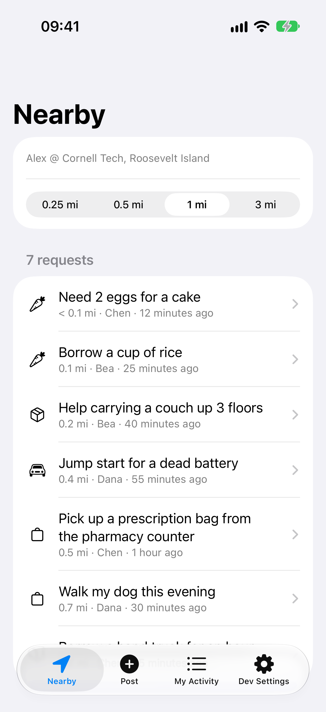
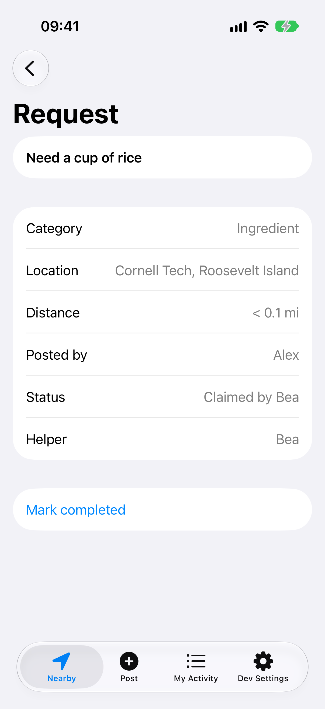
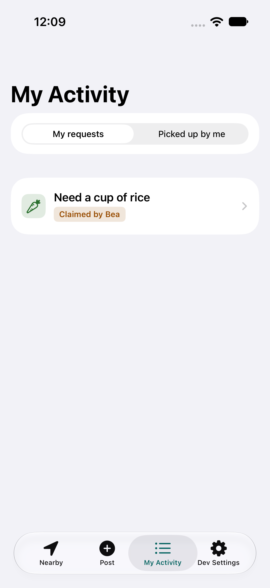
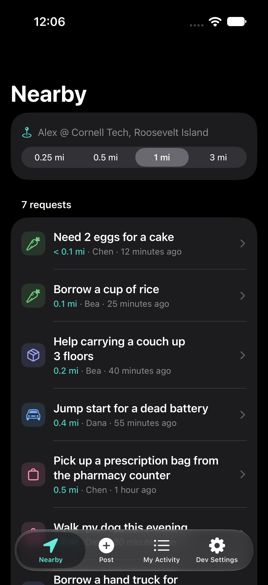

# Favorly iOS

[](https://github.com/TerenceZhang29/favorly-ios/actions/workflows/ci.yml)

Favorly is a hyperlocal iOS app that lets neighbors post small help requests and pick them up. This repo holds the prototype (version 0.3.0): SwiftUI, fake data and a fake location, run in the iOS Simulator. Phase 1 built the flows, Phase 2 gave them their look, and Phase 3 added the Kindness score, profiles, chat and reviews.

| Nearby | Request detail | My Activity | Dark mode |
| --- | --- | --- | --- |
|  |  |  |  |

The Phase 1 plan is in [docs/PLAN.md](docs/PLAN.md), the Phase 2 (UI refresh) plan in [docs/PLAN-PHASE-2.md](docs/PLAN-PHASE-2.md), the Phase 3 (Kindness score, profiles, chat and reviews) plan in [docs/PLAN-PHASE-3.md](docs/PLAN-PHASE-3.md), the layering rules in [docs/ARCHITECTURE.md](docs/ARCHITECTURE.md), and the status and decision log in [docs/PROGRESS.md](docs/PROGRESS.md).

## Prerequisites

- A Mac with the latest stable Xcode and at least one iOS Simulator runtime (iOS 17 or later)
- Command-line builds pointed at Xcode: `sudo xcode-select -s /Applications/Xcode.app`
- Homebrew tools: `brew install xcodegen swiftlint swiftformat`

## Setup

The Xcode project is generated from `project.yml` and is not checked in.

```bash
git clone git@github.com:TerenceZhang29/favorly-ios.git
cd favorly-ios
xcodegen generate
```

Run `xcodegen generate` again after any change to `project.yml`.

## Run

```bash
open Favorly.xcodeproj
```

Pick an iPhone simulator and press Run. All data is in memory and resets on every launch.

## Test

```bash
# fast logic tests, no Simulator
swift test --package-path Packages/FavorlyKit

# list simulators, then pick an available iPhone name
xcrun simctl list devices available

# build and run all tests on a simulator
xcodebuild test -project Favorly.xcodeproj -scheme Favorly \
  -destination 'platform=iOS Simulator,name=<iPhone model from the list>'
```

The second command runs the package tests again on iOS, plus the UI tests. `DemoFlowUITests` walks through the demo script below. UI tests launch the app with `-uiTesting`, which removes the 300 ms delay the mock data layer adds to mimic a network.

Every push to `main` and to `phase/**`, `ci/**` and `claude/**` branches runs both commands on GitHub Actions (`.github/workflows/ci.yml`). A second workflow, `.github/workflows/manual-checks.yml`, runs SwiftLint and SwiftFormat on `claude/**` branches (agent sessions without Xcode) or by hand from the Actions tab, and can capture the screenshots and upload them as an artifact.

## Lint and format

```bash
swiftlint --strict
swiftformat --lint .   # drop --lint to apply the fixes
```

## Demo script

One person plays both sides by switching users in the Dev Settings tab. It takes about five minutes.

1. Launch the app. Dev Settings shows *Alex @ Cornell Tech, Roosevelt Island*.
2. Nearby: 7 open requests within 1 mi, closest first. Change the radius to 0.25 mi (3 requests), then to 3 mi (8 requests), then back to 1 mi.
3. Post tab: title "Need a cup of rice", category Ingredient, location tagged at Cornell Tech. Tap Post request. My Activity opens and shows it as *Open*.
4. Dev Settings: switch to Bea. Nearby: Alex's rice request is at the top at "< 0.1 mi".
5. Open it, tap Pick up and confirm. The status becomes *Claimed by Bea*. It leaves Nearby and appears in My Activity under *Picked up by me*.
6. Dev Settings: switch back to Alex. My Activity shows the rice request as *Claimed by Bea*. Open it and tap Mark completed.
7. Dev Settings: choose Ithaca, NY. Nearby shows "No requests within 1 mi". Tap Reset demo data to finish.

### Phase 3: Kindness score, profiles, chat and reviews

Start from a fresh launch (or Reset demo data, and switch back to Alex and Cornell Tech). `DemoFlowUITests.testExtendedDemoScript` runs the same steps.

1. Profile tab: Alex has a score of 0 and "No activity yet".
2. Post "Need a cup of rice" as Alex. Switch to Bea: her Profile shows 90 points and "90 of 100 points" on the gift card.
3. As Bea, open the rice request in Nearby, Pick up, then tap Message Alex and send "On my way". Switch to Alex, open the request from My Activity, tap Message Bea, reply, go back and tap Mark completed.
4. Still as Alex, tap Leave a review: 5 stars, "Fast and friendly", Submit.
5. Switch to Bea. Profile shows 110 points, the new review and the favor under Past activities. Tap Redeem: the code `FAVORLY-0001` appears and progress reads "10 of 100 points".
6. Switch to Chen. In My Activity open "Water my plants for the weekend" and tap the Helper row: Bea's profile shows her score and reviews, but no gift card.

## Updating the screenshots

`ScreenshotUITests` is skipped unless it is given a folder to write to:

```bash
TEST_RUNNER_SCREENSHOT_DIR=/tmp/favorly-shots xcodebuild test \
  -project Favorly.xcodeproj -scheme Favorly \
  -destination 'platform=iOS Simulator,name=<iPhone model>' \
  -only-testing:FavorlyUITests/ScreenshotUITests
```

It writes each screen and its main states (25 captures) four times: `<name>-light.png`, `<name>-dark.png`, `<name>-accessibility-large.png` and `<name>-accessibility-largest.png`. The Phase 2 set is kept in `docs/screenshots/phase-2/`, and the four images above are copies from it. The Phase 1 look is kept in `docs/screenshots/phase-1/`. The Phase 3 screens (profile, chat, review form) are captured too but not yet committed; see `docs/PROGRESS.md`.

## App icon

The icon is drawn by a script, so it can be redrawn if the brand color changes:

```bash
swift scripts/make-app-icon.swift
```
